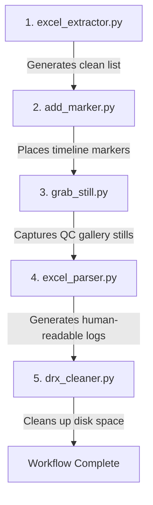

# DaVinci Resolve QC Tools & Pipeline

A Python-based automation toolkit designed to streamline the Quality Control (QC) and post-production workflows in DaVinci Resolve. This pipeline automates the tedious processes of extracting timecodes from reports, marking timelines, grabbing reference stills, and maintaining clean directories.

## 🛠️ Features & Workflow

The tools are designed to work together in a sequential, 5-step pipeline:



1. **`excel_extractor.py`**: Reads raw QC reports (Excel), extracts the timecode column (Column E), cleans up missing (`NaN`) or messy data, and generates a formatted Python list (`timecode_list = [...]`) in a text file.
2. **`add_marker.py`**: Interacts with the DaVinci Resolve API to automatically place **Red QC Markers** on your current timeline based on the extracted timecode list. It automatically calculates the `GetStartFrame` offset to ensure precise frame targeting.
3. **`grab_still.py`**: Iterates through all the Red Markers on your timeline, moves the playhead to each specific frame with micro-delays for UI stability, and triggers DaVinci Resolve's `GrabStill` command to capture gallery reference images automatically.
4. **`excel_parser.py`**: Parses metadata columns (E, F, G, H) from your Excel report to generate a clean, human-readable `.txt` log file matching each timecode with its respective problem type, subject, and detailed explanation.
5. **`drx_cleaner.py`**: A maintenance utility that safely scans your target output directory and deletes accumulated `.drx` (DaVinci Resolve Still/Grade Export) files to free up disk space and keep your folders organized.

---

## 🚀 Prerequisites & Setup

### 1. Requirements

* DaVinci Resolve Studio (API access requires the **Studio** version).
* Python 3.8+ installed on your system.
* **Pandas** and **Openpyxl** libraries installed for Excel parsing:
```bash
pip install pandas openpyxl

```